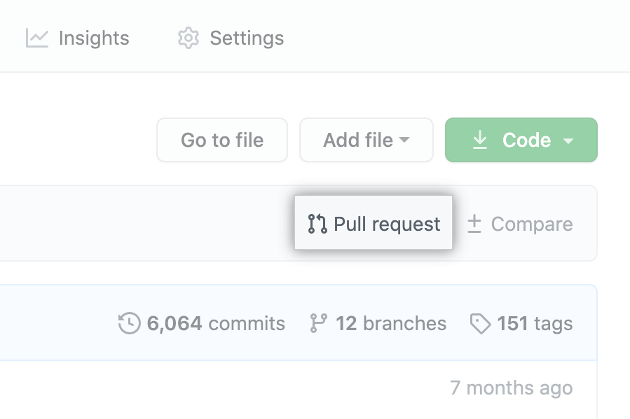

# Contribution Guide
Follow these steps to help add resources to this site.

## Step by Step Guide
1. Sign into GitHub and head to [this repository](https://github.com/nickgraffis/uci-resources).

2. Click the **Fork** button in the upper right corner.

Right now, you have a fork of the Spoon-Knife repository, but you don't have the files in that repository locally on your computer.

3. Click the **Clone or download** button.

Then copy the *SSH* or *HTTPS* link.

4. Clone the repo into your local machine by `cd`ing into the directory you would like to store the repo and `git clone` and pasting the link into the terminal.:
```bash
git clone https://github.com/YOUR-USERNAME/uci-resources.git
```

5. You can `cd uci-resources && code .` to open the repo in your editor.

6. Change the file located inside `docs` > `index.md` and add your resources.

7. Head back to [this repository](https://github.com/nickgraffis/uci-resources).

8. Click the **Pull Request** button.


9. Change the pull request to compare forks.


10. Compare `base repository: nickgraffis/uci-resourcs` > `base: main` to `head repository: <YOUR USERNAME>/uci-resources` > `compare: main`.

11. Create a pull request.