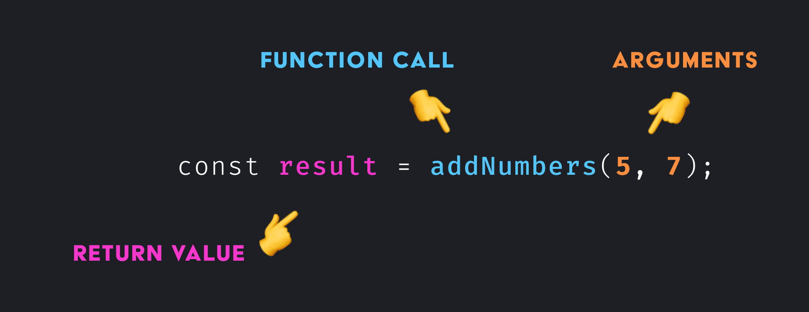

# Functions

## Anatomy of a Function

### Declaration of a Function


1. Name - The name of a function that can be used to _invoke_ it later on.
2. Parameters - A list of inputs that can be passed into a function.
3. Body - The logic or statements that perform the computation.

### Invocation of a Function

A function declaration does nothing on it's own. You make use of functions by calling them. The return value of the function can be assigned to a variable.



1. Function call - Executes the code inside the function body ☝️.
2. Aruguments - The values to be used as _parameters_ in the function.
3. Return value - By default function will return `undefined`, but can return the result of a computation when the body contains a `return` statement.


## Function Declarations vs. Expressions

**A function _declaration_ is a statement that describe what your code does. Declarations are _hoisted_, which means they are loaded at the top of the scope before any other code runs.**

```js
makeBread(2); // Call still works here

function makeBread(qty) {
  return '🍞'.repeat(qty)
}
```

An alternative approach is use a function as a value or _expression_ by assigning any anonymous function to avariable or parameter.

```js
var makeBeer = function(qty) {
  return '🍺'.repeat(qty);
}
```

## 🤔 Should you use declarations or expressions?

There is no universally accepted best-practice, but function expressions are commonly preferred for (1) their ability to be reassigned, (2) flexibility when composing higher order functions, and (3) the fact that they don’t pollute the global scope.

## Parameters and Arguments

You have a variety of ways to structure parameters in a function. Below are examples of positional, named, and rest parameters:

```js
// Positional
function makeBreakfast (main, side, drink) {
    console.log(arguments)
    return `Breakfast is ${main}, ${side}, and ${drink}.`;
}

// Named
function makeLunch (opts) {
    const { main, side, drink } = opts;
    return `Lunch is ${main}, ${side}, and ${drink}.`;
}

// Rest params
function makeDinner (main, ...args) {
    console.log(main, args)
    return `Dinner includes ${main} and ${args.join('')}.`;
}


makeBreakfast('🥞', '🥓', '🥛');

makeLunch({ main: '🥙', side: '🍟', drink: '🥤' });

makeDinner('🍜', '🥘', '🍙', '🥠', '🍑');
```