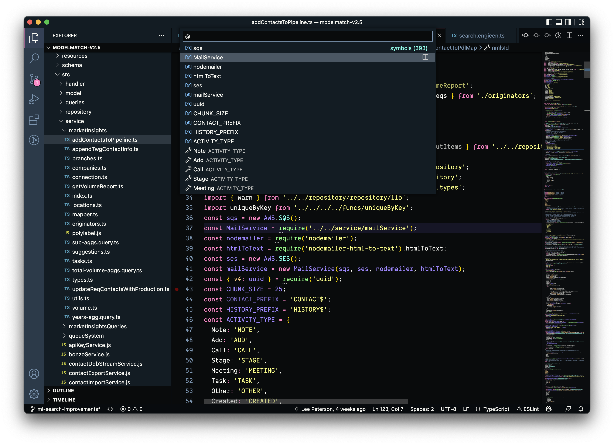

# VSCode For Pros

## Command Pallette
You can get to the command pallette with `Meta+P`. This is the most important part of VSCode without the mouse.


Here you can start typing to look for a particular document inside of your directory. This is much faster than going into the explorer and clicking an item.

### Running Commands from the Command Pallette

To run a command from the pallette just add the `>` character to the search, or you can use `Meta+Shift+P`.


This lets you find anything you can do inside vs code and run them from here. Here are just a few you might find useful to start:

1. Collapse Folders in Explorer
2. Expand Folders in Explorer
3. Close Saved Editors in Group
4. Close All Editors in Group

You can find so many commands in this menu.

## Going Beyond Ctrl F

### The @/# Symbol

The fastest way to start looking for something inside of a particular file is the open your command pallette and then type `@` followed by the _symbol_ you are looking for.



Here VSCode is showing you all of the symbols inside your code, and the `#` can d othe same for you, but across your whole project.

## Moving the Cursor

The fastest way to move through the code is to use the keyboard, not the mouse.

### The Option or Alt Key

Going through a line of code with the arrow key can be slow, but you can add the `Option` key to the arrow key to make it faster. This will go from space seperated section to the next space seperated section. Instead of character by character.

### Selecting Code

You can hold the `Shift` key down and use the arrow keys to select code. And adding the `Option` key will do as you expect, and start selecting word after word.

### Moving Code

To move a line of code you can use the arrow keys, and the `Option` key.

### Cut, Copy and Paste Code

You can Cut a line of code with `Meta + X` and copy it with `Meta + C`. You can paste it with `Meta + V`.

## Code Formatting

If you want to format your code whenever you save a file, open your command pallette and then type `Settings` and then select the `Open Settings (JSON)` option. Inside of the `settings.json` you could add this to the object:

```json
  "[javascript]": {
    "editor.defaultFormatter": "vscode.typescript-language-features",
    "editor.formatOnSave" : true,
    "editor.tabSize" : 2,
  },
```


